# 2022q1 Homework1 (quiz1)
contributed by < [`Risheng1128`](https://github.com/Risheng1128) >

> [作業說明](https://hackmd.io/@sysprog/B166rc3Jq)
> [測驗題目](https://hackmd.io/@sysprog/linux2022-quiz1)

## 測驗 `1`
:::info
延伸題目:
- [x] 解釋上述程式碼運作原理
- [ ] 研讀 Linux 核心原始程式碼 [include/linux/hashtable.h](https://github.com/torvalds/linux/blob/master/include/linux/hashtable.h) 及對應的文件 [How does the kernel implements Hashtables?](https://kernelnewbies.org/FAQ/Hashtables)，解釋 hash table 的設計和實作手法，並留意到 [tools/include/linux/hash.h](https://github.com/torvalds/linux/blob/master/tools/include/linux/hash.h) 的 `GOLDEN_RATIO_PRIME`，探討其實作考量
:::

### hash table 資料結構分析
在研究程式碼運作原理之前，這邊先討論題目使用到的資料結構，分為 `hlist_head` 、 `hlist_node` 、 `hash_key` 、 `map_t`
```c
struct hlist_head {
	struct hlist_node *first;
};

struct hlist_node {
	struct hlist_node *next, **pprev;
};

struct hash_key {
    int key;
    void *data;
    struct hlist_node node;
};

typedef struct {
    int bits;
    struct hlist_head *ht; 
} map_t;
```

首先觀察結構 `map_t` ，由一個整數 `bits` 以及一個指向結構 `hlist_head` 的指標 `ht` 所組成

其中一個成員 `bits` 是用來決定 hash table 的大小，可以從巨集 `MAP_HASH_SIZE()` 得知，從原始碼我們可以知道會產生 2^bits^ 個 `struct hlist_head` 大小的 hash table
```c
#define MAP_HASH_SIZE(bits) (1 << bits)
```

而成員 `ht` 則是指向 hash table 的指標，在 `map_init()` 中可以看到 `ht` 指向了 hash table
```c
map->ht = malloc(sizeof(struct hlist_head) * MAP_HASH_SIZE(map->bits));
```

接著觀察 `struct hash_key` ，比較特別在於該結構包含著結構 `struct hlist_node` ，可以看出是用來存放資料且主要架構為 linked list

最後觀察 `struct hlist_head` 及 `struct hlist_node` ，其中比較特別的地方在於 `struct hlist_node` 的 `pprev` 被定義為**指標的指標**，而使用該定義的原因可以參考[第 1,2 週課堂問答簡記](https://hackmd.io/5zdyXn6uQMOeSoVBapuVNw?view)

依據上述的這些結構，可以簡單畫出整個 hash table 的示意圖，如下圖所示

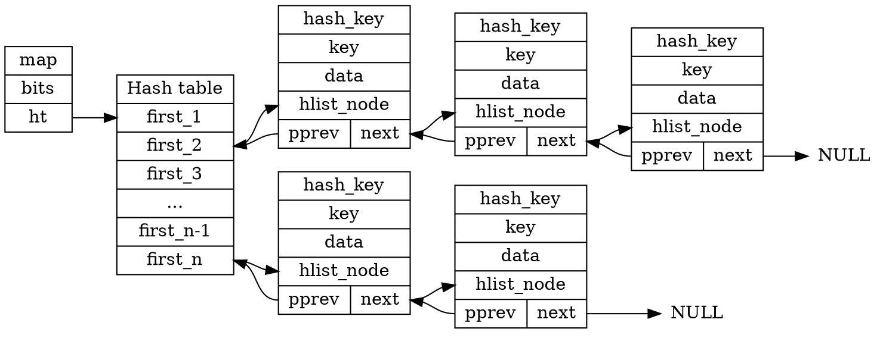

由上圖我們可以得知整個 hash table 的架構，結構 `map_t` 的成員 `ht` 指向型態為 `hlist_head` 的陣列，接著每個 `hlist_head` 的成員 `first` 後會接著節點型態為 `hlist_node` 的 linked list

### 程式碼運作原理
從函式 `twoSum()` 開始分析，以下為完整的原始碼
:::spoiler `twoSum()`
```c=
int *twoSum(int *nums, int numsSize, int target, int *returnSize)
{
    map_t *map = map_init(10);
    *returnSize = 0;
    int *ret = malloc(sizeof(int) * 2);
    if (!ret)
        goto bail;

    for (int i = 0; i < numsSize; i++) {
        int *p = map_get(map, target - nums[i]);
        if (p) { /* found */
            ret[0] = i, ret[1] = *p;
            *returnSize = 2;
            break;
        }

        p = malloc(sizeof(int));
        *p = i;
        map_add(map, nums[i], p);
    }

bail:
    map_deinit(map);
    return ret;
}
```
:::

在 `twoSum` 第 3 行，首先執行函式 `map_init()` ，其目的為建立完整的 hash table ，並且初始化，以下說明 `map_init()` 的實作流程:
1. 分配一個大小為 `map_t` 的空間
```c
map_t *map = malloc(sizeof(map_t));
if (!map)
    return NULL;
```

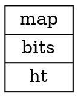

2. 根據輸入變數 `bits` 建立 2^bits^ 個 `struct hlist_head` 大小的空間，這邊使用到前面提過的巨集 `MAP_HASH_SIZE()`
```c
map->bits = bits;
    map->ht = malloc(sizeof(struct hlist_head) * MAP_HASH_SIZE(map->bits));
```

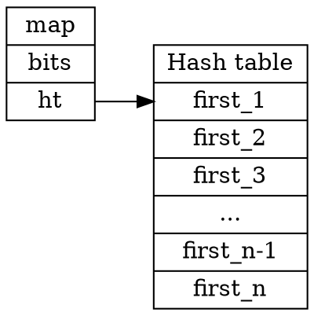

3. 初始化 hash table ，將 hash table 所有的 `hlist_head` 其成員 `first` 設定為 `NULL`
```c
if (map->ht) {
    for (int i = 0; i < MAP_HASH_SIZE(map->bits); i++)
        (map->ht)[i].first = NULL;
} else {
    free(map);
    map = NULL;
}
```

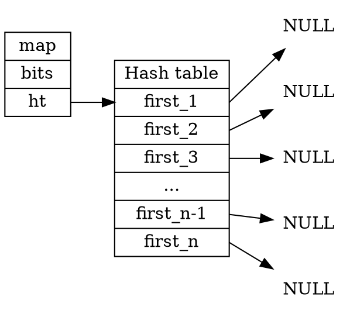

接著在 `twoSum()` 第 10 行的位置，呼叫了函式 `map_get()` ，這邊把函式 `map_get()` 及函式 `find_key` 一起做分析
```c
int *p = map_get(map, target - nums[i]);
```

在 `map_get()` 的部份比較直覺，主要步驟就是呼叫 `find_key()` 尋找是否已經有互補 (`target - nums[i]`) 的資料，有的話就回傳包含該資料的結構 `hash_key` 的 `data` ，反之則回傳 `NULL`
```c
void *map_get(map_t *map, int key)
{
    struct hash_key *kn = find_key(map, key);
    return kn ? kn->data : NULL;
}
```

而 `find_key()` 的部份較為複雜，以下為分析過程

首先建立一個指向結構 `struct hlist_head` 指標 `head` ，將 `head` 指向 hash table 的某一格欄位，而要決定選哪一格欄位是透過函式 `hash()` 執行，目前先把函式 `hash()` 當成一個 hash function 只用，詳細資料會在下一部份做解釋
```c
struct hlist_head *head = &(map->ht)[hash(key, map->bits)];
```

接著走訪整個 linked list 找到對應的 `key` ，這邊利用巨集函式 `container_of()` 找到包含節點的 `hash_key` 的起始地址，如果找到就直接回傳起始地址，失敗就回傳 `NULL`
```c
for (struct hlist_node *p = head->first; p; p = p->next) {
    struct hash_key *kn = container_of(p, struct hash_key, node);
    if (kn->key == key)
        return kn;
}
return NULL;
```

在 `twoSum()` 的第 19 行呼叫了函式 `map_add()` ，其目的在於當 hash table 沒有互補的資料時，把目前的資料 `nums[i]` 加到 hash table 裡，從原始碼得知範例是將變數 `i` 的值作為 `key` 使用
```c
map_add(map, nums[i], p);
```

在函式 `map_add()` 裡，首先判斷是否已經有該資料點，若已經存在則直接離開函式
```c
struct hash_key *kn = find_key(map, key);
if (kn)
    return;
```

建立新的 `hash_key` 結構，並把 `key` 及 `data` 複製到結構成員裡
```c
kn = malloc(sizeof(struct hash_key));
kn->key = key, kn->data = data;
```

接著將節點加進 hash table，實作方法為把節點加在第一個位置
```c
struct hlist_head *h = &map->ht[hash(key, map->bits)];
struct hlist_node *n = &kn->node, *first = h->first;
```
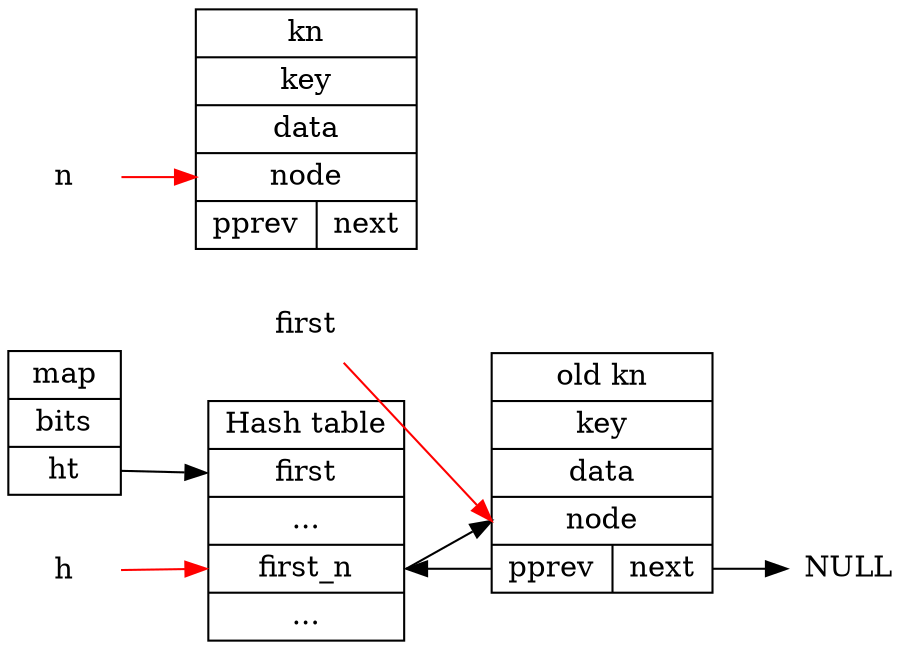
```c
n->next = first;
```
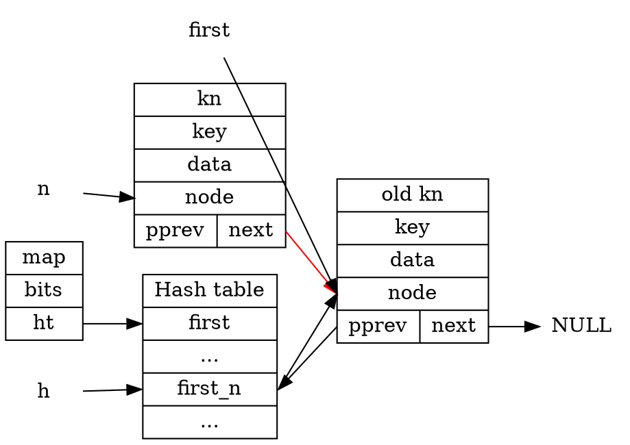
```c
if (first)
    first->pprev = &n->next;
```
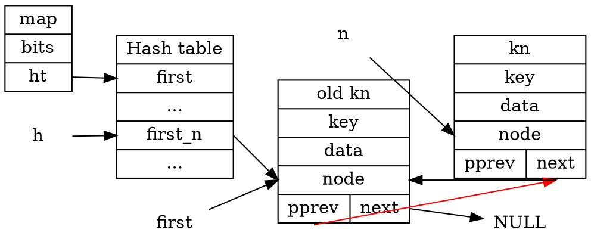
```c
h->first = n;
```
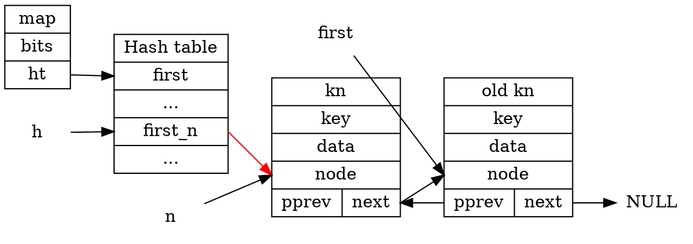
```c
n->pprev = &h->first;
```
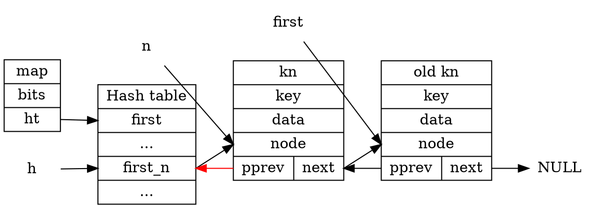
經過上述步驟，可以把節點加進 linked list 的第一個位置

最後在 `twoSum()` 的第 23 行呼叫 `map_deinit()` ，釋放整個 hash table ，原始碼如下所示
:::spoiler `map_deinit()`
```c
void map_deinit(map_t *map)
{
    if (!map)
        return;

    for (int i = 0; i < MAP_HASH_SIZE(map->bits); i++) {
        struct hlist_head *head = &map->ht[i];
        for (struct hlist_node *p = head->first; p;) {
            struct hash_key *kn = container_of(p, struct hash_key, node);
            struct hlist_node *n = p;
            p = p->next;

            if (!n->pprev) /* unhashed */
                goto bail;

            struct hlist_node *next = n->next, **pprev = n->pprev;
            *pprev = next;
            if (next)
                next->pprev = pprev;
            n->next = NULL, n->pprev = NULL;

        bail:
            free(kn->data);
            free(kn);
        }
    }
    free(map);
}
```
:::

### 研讀 Linux 核心原始程式碼 [include/linux/hashtable.h](https://github.com/torvalds/linux/blob/master/include/linux/hashtable.h)


---
## 測驗 `2`
:::info
延伸問題:
- [x] 嘗試避免遞迴，寫出同樣作用的程式碼
- [ ] 以類似 Linux 核心的 circular doubly-linked list 改寫，撰寫遞迴和迭代 (iterative) 的程式碼
:::

### 實作非遞迴版本
參考 [82. Remove Duplicates from Sorted List II](https://leetcode.com/problems/remove-duplicates-from-sorted-list-ii/)
想法思考
1. 在 leetcode 裡，其資料的範圍為 -100 &leq; val &leq; 100 ，因此考慮建立一個大小為 201 個 `int` 大小的陣列 `freq` 用來紀錄每個資料出現的次數
2. 走訪整個 linked list ，將每個資料出現的次數紀錄起來
3. 接著再走訪一次 linked list ，將出現次數大於 1 的節點刪除

使用此方法可以讓時間複雜度只有 O(n)
```c
#define MAXSIZE 201
struct ListNode *deleteDuplicates(struct ListNode *head){
    int freq[MAXSIZE] = {0};
    struct ListNode *tmp = head;
    while (tmp) {
        (*(freq + tmp->val + 100))++;
        tmp = tmp->next;
    }
    
    struct ListNode **indirect = &head;
    while (*indirect) {
        if (*(freq + (*indirect)->val + 100) > 1)
            *indirect = (*indirect)->next;
        else
            indirect = &(*indirect)->next;
    }
    return head;
}
```

### 以類似 Linux 核心的 circular doubly-linked list 改寫，撰寫==遞迴==的程式碼

### 以類似 Linux 核心的 circular doubly-linked list 改寫，撰寫==迭代==的程式碼
這邊採用自己 [開發紀錄 (lab0-c)](https://hackmd.io/@Risheng/linux2022-lab0) 的實作方法
```c
bool q_delete_dup(struct list_head *head)
{
    // https://leetcode.com/problems/remove-duplicates-from-sorted-list-ii/
    if (!head || list_empty(head) || list_is_singular(head))
        return false;

    struct list_head *curr = head->next, *next = curr->next;
    bool key = false;

    while (curr != head && next != head) {
        element_t *curr_entry = list_entry(curr, element_t, list);
        element_t *next_entry = list_entry(next, element_t, list);

        while (next != head && !strcmp(curr_entry->value, next_entry->value)) {
            list_del(next);
            q_release_element(next_entry);
            next = curr->next;
            next_entry = list_entry(next, element_t, list);
            key = true;
        }

        if (key) {
            list_del(curr);
            q_release_element(curr_entry);
            key = false;
        }

        curr = next;
        next = next->next;
    }
    return true;
}
```

---
## 測驗 `3`
:::info
延伸問題:
- [x] 解釋上述程式碼的運作，撰寫完整的測試程式
- [ ] 指出其中可改進之處並實作
- [ ] 在 Linux 核心找出 LRU 相關程式碼並探討
:::

### 資料結構及初始化
在分析整個流程之前，首先先將整個 Cache 及資料的結構釐清，以下為分析結果
```c
/* Cache 結構 */
typedef struct {
    int capacity, count;
    struct list_head dhead, hheads[];
} LRUCache;

/* 存放資料的結構 */    
typedef struct {
    int key, value;
    struct list_head hlink, dlink;
} LRUNode;

/** 
 * @fn     - lRUCacheCreate
 * @brief  - 建立 Cache 資料結構並初始化
 * 
 * @attention 函式邏輯
 * 1. 建立 Cache 的結構，大小為 sizeof(*obj) + capacity * sizeof(struct list_head)
 * 2. 初始化所有變數 (count, capacity)
 * 3. 初始化 dhead
 * 4. 對每個 hhead[i] 初始化
 *
 */
LRUCache *lRUCacheCreate(int capacity)
{
    LRUCache *obj = malloc(sizeof(*obj) + capacity * sizeof(struct list_head));
    obj->count = 0;
    obj->capacity = capacity;
    INIT_LIST_HEAD(&obj->dhead);
    for (int i = 0; i < capacity; i++)
        INIT_LIST_HEAD(&obj->hheads[i]);
    return obj;
}
```
從上面的程式碼可以歸類出兩種結構，分別是 Cache 及資料節點，示意圖如以下所示
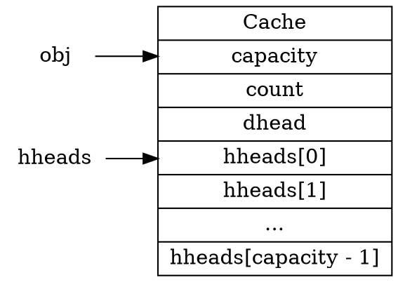
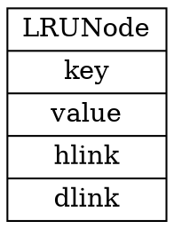

### 程式運作原理
#### `lRUCachePut()`: 添加資料到 Cache 裡
```c
/** 
 * @fn     - lRUCachePut
 * @brief  - 添加資料到 Cache 裡
 * 
 * @attention 函式邏輯
 * 1. 利用 hash function 算出 hash table (hash) 的位置，這邊的 hash function 為 key % obj->capacity
 * 2. 接著以下有三種可能
 *    (1) 走訪 hheads[hash] 成員 hlink 的整個 linked list ，尋找 key 是否已經存在
 *        - 如果存在就更新 value 並將該資料的 dlink 移到 dhead 的第一個位置
 *    (2) key 不存在就進到 (2) 和 (3) 的情況，如果 capcity 已經滿了
 *        - 把 dhead 的最後一個 LRUNode 取出，這邊使用 list_last_entry 可以直接做到
 *        - 接著更新 key 及 value，並將 dlink 及 hlink 分別放進 dhead 和 hheads[hash] 的第一個
 *    (3) 如果 capcity 已經沒有滿，建立新的 LRUNode 並增加 count
 *        - 更新 key 及 value，並將 dlink 及 hlink 分別放進 dhead 和 hheads[hash] 的第一個
 */
void lRUCachePut(LRUCache *obj, int key, int value)
{
    LRUNode *lru;
    // 利用 hash function 算出 hash table (hash) 的位置
    int hash = key % obj->capacity;
    // 走訪 hheads[hash] 成員 hlink 的整個 linked list ，尋找 key 是否已經存在
    list_for_each_entry(lru, &obj->hheads[hash], hlink) {
        // 如果存在就更新 value 並將該資料的 dlink 移到 dhead 的第一個位置
        if (lru->key == key) {
            list_move(&lru->dlink, &obj->dhead);
            lru->value = value;
            return;
        }
    }

    if (obj->count == obj->capacity) {
        // 把 dhead 的最後一個 LRUNode 取出
        lru = list_last_entry(&obj->dhead, LRUNode, dlink);
        list_del(&lru->dlink);
        list_del(&lru->hlink);
    } else {
        // 如果 capcity 已經沒有滿，建立新的 LRUNode 並增加 count
        lru = malloc(sizeof(LRUNode));
        obj->count++;
    }
    // 更新 key 及 value，並將 dlink 及 hlink 分別放進 dhead 和 hheads[hash] 的第一個
    lru->key = key;
    list_add(&lru->dlink, &obj->dhead);
    list_add(&lru->hlink, &obj->hheads[hash]);
    lru->value = value;
}
```

#### `lRUCacheGet()`: 利用 key 回傳 cache 的資料，無資料則回傳 -1
```c
/** 
 * @fn     - lRUCacheGet
 * @brief  - 利用 key 回傳 cache 的資料，無資料則回傳 -1
 * 
 * @attention 函式邏輯
 * 1. 利用 hash function 算出 hash table (hash) 的位置，這邊的 hash function 為 key % obj->capacity
 * 2. 走訪 hheads[hash] 成員 hlink 的整個 linked list ，尋找 key 是否已經存在 
 * 3. 如果找到了 key ，將該資料的 dlink 移到 dhead 的第一個位置，並回傳 value
 * 4. 如果沒有 key 就回傳 -1
 */
int lRUCacheGet(LRUCache *obj, int key)
{
    LRUNode *lru;
    // 算出 hash map 的位置
    int hash = key % obj->capacity;
    // 走訪 hheads[hash] 的 hlink 尋找 key 是否存在
    list_for_each_entry(lru, &obj->hheads[hash], hlink) {
        if (lru->key == key) {
            // 該資料的 dlink 移到 dhead 的第一個位置
            list_move(&lru->dlink, &obj->dhead);
            return lru->value;
        }
    }
    // 沒有 key 就回傳 -1
    return -1;
}
```

#### `lRUCacheFree()`: 釋放所有記憶體空間
```c
/** 
 * @fn     - lRUCacheFree
 * @brief  - 釋放所有記憶體空間
 * 
 * @attention 函式邏輯
 * 1. 使用 list_for_each_entry_safe 走訪整個 dhead
 *    - 會有兩個指標 lru 及 n 分別指著前後兩個節點 (lru 前，n 後)
 *    - 釋放 lru 指到的空間後，lru 移到 n 的位置，n 再往下移動，並重複此過程
 * 2. 釋放 cache 結構
 */
void lRUCacheFree(LRUCache *obj)
{
    LRUNode *lru, *n;
    // 使用 list_for_each_entry_safe 走訪整個 dhead
    list_for_each_entry_safe(lru, n, &obj->dhead, dlink) {
        list_del(&lru->dlink);
        // 釋放 lru 指到的空間
        free(lru);
    }
    // 釋放 cache 結構
    free(obj);
}
```

### 測試程式
這邊參考 [146. LRU Cache](https://leetcode.com/problems/lru-cache/) 所給的範例，並撰寫測試程式，如以下所示:
```c
/** 
 * @fn     - main
 * @brief  - 測試 Cache 的功能是否正常
 * 
 * @attention
 * 範例參考 146.LRU Cache (https://leetcode.com/problems/lru-cache/)
 * 
 */
int main(void) 
{
    LRUCache *test = lRUCacheCreate(2);
    lRUCachePut(test, 1, 1);
    lRUCachePut(test, 2, 2);
    printf("data1 = %d\n", lRUCacheGet(test, 1));
    lRUCachePut(test, 3, 3);
    printf("data2 = %d\n", lRUCacheGet(test, 2));
    lRUCachePut(test, 4, 4);
    printf("data3 = %d\n", lRUCacheGet(test, 1));
    printf("data4 = %d\n", lRUCacheGet(test, 3));
    printf("data5 = %d\n", lRUCacheGet(test, 4));
    lRUCacheFree(test);
    return 0;
}
```
測試結果，和 leetcode 所給的答案一致
```shell
make
gcc -O1 -g -Wall -Werror -IInclude -o problem3.out quiz1/problem3.c -lm
./problem3.out
data1 = 1
data2 = -1
data3 = -1
data4 = 3
data5 = 4
```

### 可改進的地方
:::warning
To do: 目前想法是原本加資料和取資料的流程都會走訪整個 linked list ，會導致時間複雜度不會保持 O(1)，因此會往減少時間複雜度的方向思考

:::

---
## 測驗 `4`
:::info
延伸問題:
- [x] 解釋上述程式碼的運作，撰寫完整的測試程式，指出其中可改進之處並實作
- [ ] 嘗試用 Linux 核心風格的 hash table 重新實作上述程式碼
:::

### 資料結構及初始化
探討本題的作法，可以從 `struct seq_node` 及函式 `longestConsecutive()` 前半段開始
```c
/* 儲存資料的結構 */
struct seq_node {
    int num;
    struct list_head link;
};
```

```c
int longestConsecutive(int *nums, int n_size)
{
    int hash, length = 0;
    struct seq_node *node;
    // 建立整個 hash table
    struct list_head *heads = malloc(n_size * sizeof(*heads));

    for (int i = 0; i < n_size; i++)
        INIT_LIST_HEAD(&heads[i]);

    for (int i = 0; i < n_size; i++) {
        // 對每一筆資料 num[i] 進行搜尋
        if (!find(nums[i], n_size, heads)) {
            // 加到對應的 hash table 上
            hash = nums[i] < 0 ? -nums[i] % n_size : nums[i] % n_size;
            node = malloc(sizeof(*node));
            node->num = nums[i];
            list_add(&node->link, &heads[hash]);
        }
    }
    ...
```

從上述的程式碼可以得知，程式主要架構是建立一個 hash table ，並且計算每個資料 nums[i] 的 hash ，將不重複的資料複製到 seq_node 並加到計算出的 hash table 的位置，以下為示意圖:
:::warning
圖中的 linked list 都為雙向環狀結構
:::
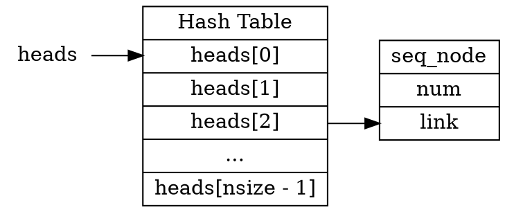
### 程式運作原理
:::info
解題思路
大概了解整個程式的運作後，可以知道 `left` 和 `right` 的功能是要分別找比較大和比較小的值，至於 `LLL` 和 `RRR` 的關鍵在於 `int left = num, right = num;` ，可以得知 `left` 和 `right` 的起始值都是 `num` ，因此我們可以得知最精簡的方式就是直接分別把 `left` 減 `1` 且 `right` 加 `1` ，因此我們可以得到以下解答：
`LLL` = `--left`
`RRR` = `++right`
:::
#### `longestConsecutive()`: 找到最長的連續序列，回傳其長度
```c
/** 
 * @fn     - longestConsecutive
 * @brief  - 找到最長的連續序列，回傳其長度
 * 
 * @attention 函式邏輯
 * 1. 建立整個 hash table ，並初始化
 * 2. 對每一筆資料 num[i] 進行搜尋，如果不存在就建立新的 seq_node 並加到對應的 hash table 上
 * 3. 再次收尋每個資料，找到資料節點後，把該節點 remove，並且分別往比較小和比較大的值開始尋找，直到兩邊都沒有資料
 * 4. 找完之後和過去找到的長度比較，若比較長則更新，反之則不變
 */
int longestConsecutive(int *nums, int n_size)
{
    int hash, length = 0;
    struct seq_node *node;
    // 建立整個 hash table
    struct list_head *heads = malloc(n_size * sizeof(*heads));

    for (int i = 0; i < n_size; i++)
        INIT_LIST_HEAD(&heads[i]);

    for (int i = 0; i < n_size; i++) {
        // 對每一筆資料 num[i] 進行搜尋
        if (!find(nums[i], n_size, heads)) {
            // 加到對應的 hash table 上
            hash = nums[i] < 0 ? -nums[i] % n_size : nums[i] % n_size;
            node = malloc(sizeof(*node));
            node->num = nums[i];
            list_add(&node->link, &heads[hash]);
        }
    }
    
    // 再次收尋每個資料
    for (int i = 0; i < n_size; i++) {
        int len = 0;
        int num;
        node = find(nums[i], n_size, heads);
        while (node) {
            len++;
            // 複製資料
            num = node->num;
            // 找到資料節點後，把該節點 remove
            list_del(&node->link);
            // 分別往比較小和比較大的值開始尋找
            int left = num, right = num;
            // 往比較小的值開始找
            while ((node = find(++left, n_size, heads))) {
                len++;
                // 如果存在就 remove
                list_del(&node->link);
            }
            // 往比較大的值開始找
            while ((node = find(++right, n_size, heads))) {
                len++;
                // 如果存在就 remove
                list_del(&node->link);
            }
            // 找完之後和過去找到的長度比較，若比較長則更新，反之則不變
            length = len > length ? len : length;
        }
    }
    return length;
}
```

#### `find()`: 尋找資料 num 有沒有存在資料節點 seq_node 上
```c
/** 
 * @fn     - find
 * @brief  - 尋找資料 num 有沒有存在資料節點 seq_node 上
 * 
 * @attention 函式邏輯
 * 1. 利用 hash function 算出 hash table (hash) 的位置，這邊的 hash function 為 num < 0 ? -num % size : num % size
 * 2. 走訪整個 heads[hash] 接著的 linked list ，尋找資料 num 有沒有存在
 * 3. 如果存在則回傳該節點，沒有則回傳 NULL
 */
static struct seq_node *find(int num, int size, struct list_head *heads)
{
    struct seq_node *node;
    // 利用 hash function 算出 hash table (hash) 的位置
    int hash = num < 0 ? -num % size : num % size;
    // 走訪整個 heads[hash] 接著的 linked list ，尋找資料 num 有沒有存在
    list_for_each_entry (node, &heads[hash], link) {
        if (node->num == num)
            // 如果存在則回傳該節點
            return node;
    }
    // 沒有則回傳 NULL
    return NULL;
}
```

### 測試程式
這邊參考 [128. Longest Consecutive Sequence](https://leetcode.com/problems/longest-consecutive-sequence/) 所給的範例，並撰寫測試程式，如以下所示:
```c
/** 
 * @fn     - main
 * @brief  - 測試 Longest Consecutive Sequence 是否正確
 * 
 * @attention
 * 範例參考 128. Longest Consecutive Sequence (https://leetcode.com/problems/longest-consecutive-sequence/)
 * 
 */
int main(void)
{
    int nums1[6] = {100, 4, 200, 1, 3, 2};
    printf("test1 = %d\n", longestConsecutive(nums1, 6));
    int nums2[10] = {0, 3, 7, 2, 5, 8, 4, 6, 0, 1};
    printf("test2 = %d\n", longestConsecutive(nums2, 10));
    return 0;
}
```

測試結果如下，和 leetcode 的答案符合
```shell
gcc -O1 -g -Wall -Werror -IInclude -o problem4.out quiz1/problem4.c -lm
./problem4.out
test1 = 3
test2 = 9
```

### 可改進的地方
首先，在函式 `longestConsecutive()` 第二次走訪整個資料的時候，會進到 `while (node)` ，從整個程式邏輯可以看到 `while` 即將結束時， `node` 一定為 `NULL` 因此可以改成 `if` 即可
```diff
// 再次收尋每個資料
    for (int i = 0; i < n_size; i++) {
        int len = 0;
        int num;
        node = find(nums[i], n_size, heads);
-       while (node) {
+       if (node) {
            len++;
            // 複製資料
            num = node->num;
```

接著可以看到整個程式碼呼叫了非常多次的 `malloc` ，卻沒有任何的 `free` ，因此應該要在節點被 remove 的時候適當的釋放記憶體，並在程式最後把整個 hash table 釋放，以下為新增的部份
```diff    
    // 再次收尋每個資料
    for (int i = 0; i < n_size; i++) {
        int len = 0;
        int num;
        node = find(nums[i], n_size, heads);
        if (node) {
            len++;
            // 複製資料
            num = node->num;
            // 找到資料節點後，把該節點 remove
            list_del(&node->link);
+           free(node);
            // 分別往比較小和比較大的值開始尋找
            int left = num, right = num;
            // 往比較小的值開始找
            while ((node = find(++left, n_size, heads))) {
                len++;
                // 如果存在就 remove
                list_del(&node->link);
+               free(node);
            }
            // 往比較大的值開始找
            while ((node = find(++right, n_size, heads))) {
                len++;
                // 如果存在就 remove
                list_del(&node->link);
+               free(node);
            }
            // 找完之後和過去找到的長度比較，若比較長則更新，反之則不變
            length = len > length ? len : length;
        }
    }
+   free(heads);
    return length;
}
```


